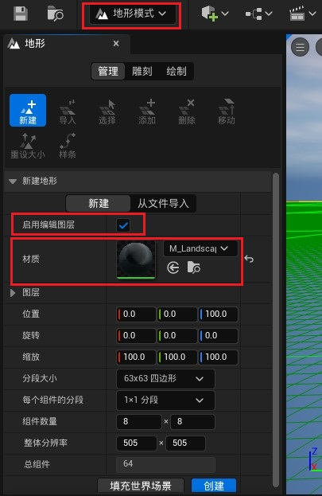
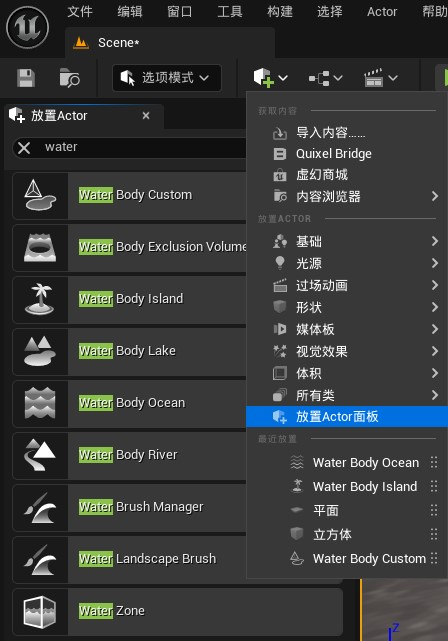

# 使用UE自带的插件创建水体

## 1 使用前准备

### 1.1 启用水体插件

添加UE插件：点击 **编辑（Edit）> 插件（Plugin）** 打开 **插件** 浏览器。搜索 **水体（Water）** 插件，勾选复选框从而启用它

> - 启用插件后重启编辑器让插件生效
>
>   > 重启编辑器后，编辑器会提示水体碰撞错误的提示，点击**将条目添加到DefaultEngine.ini中**即可，否则水体与其它物体的交互会发生错误，如果还有错误，再次重启编辑器
>
> - **Water**是水插件的主体，而**Water Extras**只是包括了一些使用案例
> - 可以配合**Landmass**插件绘制地形

### 1.2 查看水体插件中的内容

水体插件中包含一些默认的材质和内容，可以在内容浏览器的 **水体内容（Water Content）** 中找到这些内容（首先要在内容浏览器的选项中选择展示引擎和插件内容）。

如果需要对插件中提供的默认材质进行修改，可以将其复制到自己的项目目录中再进行修改。

## 2 创建不同种类的水体Actor

水体（water body）是由许多的水网格体组成，将水网格体Actor放置在场景中，引擎会自动生成所需要的网格体，不同的水网格体Actor之间还会自动生成过渡效果，如河流汇入海洋的过渡。

### 2.1 放置水体Actor

首先打开**地形模式（landscape）**，选择启用编辑图层，这样就可以让水体系统与地形地貌（landmass）插件协同运作，点击创建生成地形。如果是已有的地形，在右侧细节部分启用.

​															

在放置Actor的面板中可以看到多种水体类型，选择其中需要的水体Actor放置到场景中

​								       

### 2.2 海洋水体

**海洋水体（Ocean Water Body）** 由闭环样条线定义，它形成岸线并从这些样条线点将水渲染到远处。这些样条线点在关卡中的高度位置都相同。

> - 如果场景中已经存在其它的地形，海洋水体默认会与其它地形共同计算，影响最终生成的地形。可以在 Terrain > Affects Landscape 选项中改为False即可取消对当前其它地形的影响

海洋水体会自动延伸到远处，水体远处使用的材质与本身使用的材质是不同的

在不同的摄像机视角下，远处水体消失的情况并不相同。

> 根据情况可以自行设定远距离范围的值，合理控制对机器性能的影响
>
> - 如果摄像头一般处在靠近地面位置，很难看到海洋的尽头，可以减少水体延伸距离
> - 如果摄像头会处在空中的位置，则很容易看到海洋的尽头，可以增加水体延伸距离

**远距离网格体（Far Distance Mesh）** 在 **水区（Water Zone）** Actor中默认启用。**远距离网格体范围（Far Distance Mesh Extent）** 已设置了足够大的距离，可延伸到世界边缘

若需要更改范围的大小：

- 转至 **水区Actor（WaterZone Actor）> 渲染（Rendering）> 远距离（FarDistance）** ，并更改 **远距离网格体范围（Far Distance Mesh Extent）** 的值。

> 为保持一致，当你调整海洋水材质的颜色或其他属性时，请确保对 **Water_FarMesh** 材质做出相同更改。这样做可确保它们在远处混合在一起。（主要是修改颜色）

### 2.3 湖泊水体

**湖泊水体（Lake Water Body）** 由其闭环定义，它形成湖泊并切割出水下地形。其每个样条线点受限于所有点***必须位于相同高度***，不同于河流样条线点。

### 2.4 河流水体

**河流水体（River Water Body）** 由其带有开始点和结束点的开放样条线定义。河流将沿样条线路径切割出水下地形。河流允许样条线点有不同的高度。它们不使用波浪驱动表面运动。相反，河流会使用样条线上的各个点的速度来驱动运动。速度写入水流贴图，该贴图将沿样条线的走向驱动水面的水流视觉效果。

河流水体充当其他水体之间的连接。在湖泊和海洋与河流相交处，你可以使用过渡材质自动将它们无缝混合在一起。

### 2.5 岛屿水体

**岛屿水体（Island Water Body）** 基于样条线创建岛屿，并包含类似于其他水体的地球化功能按钮。其唯一用途是影响水下地形，确保给定地块始终在水面之上。其地球化在其他所有水体之后应用。

### 2.6 自定义水体

**自定义水体（Water Body Custom）** 使用带有其他水体所使用的相同水材质的静态网格体。它还使用相同的网格化系统，并增加了一些自定义灵活性，例如创建池塘的水面。主要区别在于，自定义水体不使用[水网格体Actor](https://docs.unrealengine.com/5.3/zh-CN/water-meshing-system-and-surface-rendering-in-unreal-engine)，因此不会自动切割出地貌。自定义水体可以使用[水波资产](https://docs.unrealengine.com/5.3/zh-CN/simulating-waves-using-the-water-waves-asset-in-unreal-engine)中的 **波浪来源（Wave Source）** 和水下后期处理。

> - 自定义水体可以看作是一个自带材质的平面，因此不会切割地形，也不会有浮力等特殊的性质，所以可以在小型的封闭场景中使用

## 3 水体属性

> - 插件中提供了项目中水体属性的默认值，如果需要进行修改，可以打开 **编辑 > 项目设置 > 插件 > Water Editor** 进行设置

### 3.1 Selected Points（样条点）

利用 **选定点（Selected Points）** 类别，你可以循环遍历当前选定的水体样条线点。每个样条线点都有属性，包括其位置、旋转和类型。一些样条线点还有特定于水体的属性，例如，河流有额外属性来定义深度和宽度。

样条点都可以通过在场景中直接点击拖动进行编辑，其中比较特殊的是河流水体的样条点，除了能控制样条点的位置，还可以控制样条点部分的河流速度、河流宽度、河流深度属性，可以在细节面板中调整值的大小，也可以右键选项打开水体可视化部分，在场景中会出现新的控制点，鼠标点击并拖动可以进行修改。

### 3.2 Water（水）

**水（Water）** 类别包含有关选定水体的信息。它还会列出哪些 **岛屿（Islands）** 和 **排除体积（Exclusion Volumes）** 会影响它。在其中每个类别下，你可以找到GPU驱动的波浪数据的索引编号。

> - Water Body Index用于在Water_Material中正确计算水体的波浪，每当创建一个水体后都会自动分配索引，也可以手动设置

### 3.3 Terrain（地貌）

Terrain（地貌）属性表示水体如何影响地形

#### **Curve Settings**（曲线设置）

## 4 浮力系统

# 水体效果

## 1 材质

材质面板下可以通过更改混合模式和着色模型控制材质的表现，在半透明+默认光照下可以选择光照模式

材质可以与水体Actor结合使用，但着色模型必须是单层水

其中比较适合用作水的混合模式和着色模型如下表

|                                       | 优点                               | 缺点                                                         | 适用场景             |
| ------------------------------------- | ---------------------------------- | ------------------------------------------------------------ | -------------------- |
| 不透明+默认光照                       | 性能开销最低                       | 不透明，非常不真实                                           | 适合做远景           |
| 不透明+默认光照+池底贴图              | 性能开销较低，模拟透明效果         | 实际上不透明                                                 | 较浅的水池           |
| 半透明+无光照+折射率                  | 能透明材质中开销最小               | 可以将法线与颜色混合作为自发光颜色模拟波纹，但是相机抬高后不真实 | 相机不需要抬高的场景 |
| 半透明+默认光照+折射率+体积方向       | -                                  | 与无光照效果类似，但是开销变大                               | 不推荐               |
| 半透明+默认光照+折射率+表面半透明体积 | 提供了折射的效果，并且折射开销最低 | 缺少表面波光粼粼的效果，添加折射效果一般                     |                      |
| 半透明+默认光照+折射率+表面向前体积   | 反射效果比单层水更好               | 开销最高                                                     |                      |
| 不透明+单层水着色                     | 综合性能最好                       |                                                              |                      |

### 1.1 不透明+默认光照

最基础的水材质设置，多个纹理贴图共同作用形成水的波纹。

|  参数  |                             效果                             |
| :----: | :----------------------------------------------------------: |
| 粗糙度 | 粗糙材质的表面会向更多方向散射反射光，控制反射的模糊或锐利程度（或者高光区域的范围大小），适当增加产生波光粼粼的效果 |
| 高光度 |              定义表面的反光程度，过高会有塑料感              |
| 金属感 |                    适当增加减少水的塑料感                    |

### 1.2 不透明+默认光照+池底贴图

在之前的基础上，在基础颜色部分添加场景的贴图，起到一种看似透明的效果

### 1.3 半透明+无光照+折射率

### 1.4 半透明+默认光照+折射率+体积方向

### 1.5 半透明+默认光照+折射率+表面半透明体积

### 1.6 半透明+默认光照+折射率+表面向前体积

## 2 水体互动

